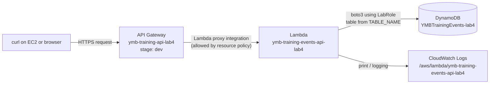

# Lab 4 Starter: Explore and Test Your Serverless API Step by Step

## Purpose

`setup-lab4.sh` builds the Tutorial 3 end state for you in a few seconds. That is convenient, but a script hides how the pieces fit together. In this guide you will look at each resource the script created, test each layer on its own, and then follow one request through the whole system.

Running `test-lab4.sh` tells you whether the API works. This guide shows you **why** it works and where to look when it doesn't.

**Duration:** 30–40 minutes

## Learning outcomes

By the end of this guide, you should be able to:

- identify the DynamoDB table, Lambda function, and API Gateway API created for Lab 4;
- explain how API Gateway finds the Lambda function, and how Lambda finds the table;
- test Lambda directly, without API Gateway;
- test API Gateway in the console, then through the deployed stage with `curl`;
- trace a single request in CloudWatch Logs; and
- predict which layer fails when one connection is broken.

## Before you start

Work in a terminal on your EC2 instance, from the `training-portal/lab4-starter` folder of your fork. These are **EC2 terminal** commands unless a step says **AWS console**.

```bash
bash setup-lab4.sh
source ./lab4.env
echo "$AWS_DEFAULT_REGION $TABLE_NAME $LAMBDA_FUNCTION_NAME $API_ID"
echo "$API_URL"
```

`lab4.env` holds resource names and the public API URL only. It contains no credentials. If you open a new terminal, run `source ./lab4.env` again.

Use synthetic YMB data only.

---

# Part 1: The architecture you have



| Connection           | What makes it work                                                                                                                 | Where you will verify it                    |
| -------------------- | ---------------------------------------------------------------------------------------------------------------------------------- | ------------------------------------------- |
| Client → API Gateway | The deployed `dev` stage URL                                                                                                       | `API_URL` and `curl`                        |
| API Gateway → Lambda | An `AWS_PROXY` integration on each method, plus a Lambda resource-based policy that allows `apigateway.amazonaws.com` to invoke it | `get-integration` and `get-policy` (Part 4) |
| Lambda → DynamoDB    | The `TABLE_NAME` environment variable and the `LabRole` execution role                                                             | `get-function-configuration` (Part 3)       |
| Lambda → CloudWatch  | `LabRole` log permissions                                                                                                          | `aws logs tail` (Part 7)                    |

**Prediction checkpoint:** If the `TABLE_NAME` environment variable pointed to the wrong table, would API Gateway still invoke Lambda? Which layer would fail?

You will test this prediction in Part 8.

---

# Part 2: Inspect the data layer (DynamoDB)

**Why this matters:** Every later test reads or writes this table. Knowing what's in it before you start lets you tell a missing item apart from a broken route.

```bash
aws dynamodb describe-table \
    --table-name "$TABLE_NAME" \
    --query 'Table.{Name:TableName,Status:TableStatus,Keys:KeySchema,Billing:BillingModeSummary.BillingMode}'

aws dynamodb scan --table-name "$TABLE_NAME"
```

**AWS console:** Open **DynamoDB > Tables > YMBTrainingEvents-lab4 > Explore table items**.

**Verification checkpoint:**

- The status is `ACTIVE`, and the only key is `eventId` (`HASH`).
- The scan returns `TRN001` and `TRN002`.

**Reflection checkpoint:** The CLI shows values as `{"S": "TRN001"}`. Later, the API returns `"TRN001"`. Which component converts between the two formats? (Hint: look at how the Lambda code uses `boto3.resource`.)

---

# Part 3: Inspect and test the compute layer (Lambda)

## 3.1 Inspect the configuration

```bash
aws lambda get-function-configuration \
    --function-name "$LAMBDA_FUNCTION_NAME" \
    --query '{Runtime:Runtime,Handler:Handler,Role:Role,Env:Environment.Variables,Timeout:Timeout}'
```

**Verification checkpoint:**

- `Handler` is `lambda_function.lambda_handler`, so Lambda calls the `lambda_handler` function in `lambda_function.py`.
- `Role` ends in `role/LabRole`. This role decides which AWS calls the function may make.
- `Env.TABLE_NAME` matches `$TABLE_NAME`. This is how the code knows which table to use; the name isn't written into the code.

**AWS console:** Open **Lambda > Functions > ymb-training-events-api-lab4**. Find the same values under **Code**, **Configuration > Environment variables**, and **Configuration > Permissions**.

## 3.2 Invoke Lambda directly

**Why this matters:** Testing Lambda without API Gateway separates the Python logic from the routing. If this passes but the API fails, the problem is in API Gateway, not the code.

A Lambda test event is a JSON document shaped like the one API Gateway would send. Open [events/lambda/get_event_trn001.json](events/lambda/get_event_trn001.json) and look at these fields:

- `httpMethod` and `resource`: the dispatcher in `lambda_handler` uses them to choose a function.
- `pathParameters.eventId`: read by `event_id_from_path`.
- `body`: a **string** of JSON, not a JSON object. This is how the proxy integration delivers request bodies.

**Prediction checkpoint:** What status code and body should this event return?

```bash
aws lambda invoke \
    --function-name "$LAMBDA_FUNCTION_NAME" \
    --payload fileb://events/lambda/get_event_trn001.json \
    response.json
cat response.json; echo
```

**Verification checkpoint:** The CLI output shows `"StatusCode": 200`, and `response.json` contains `"statusCode": 200` with the `TRN001` item.

These are two different status codes. The first means Lambda **ran successfully**. The second is the **HTTP status your code chose** for the API response. A function can run successfully and still return `404`.

## 3.3 Repeat with the other events

**AWS console option:** In the Lambda console, choose **Test**, create a test event, paste a file's contents, and run it. Save each test event using the file name.

Run them in this order, predicting each result first:

| Order | Event file                         | Expected `statusCode` | What it proves                         |
| ----- | ---------------------------------- | --------------------- | -------------------------------------- |
| 1     | `list_events.json`                 | 200                   | Scan path works                        |
| 2     | `get_event_unknown.json`           | 404                   | Missing item is handled, not an error  |
| 3     | `post_event_trn900.json`           | 201                   | Item is written to DynamoDB            |
| 4     | `post_event_trn900.json` (again)   | 409                   | Conditional write prevents overwriting |
| 5     | `post_event_missing_title.json`    | 400                   | Validation runs before DynamoDB        |
| 6     | `post_event_malformed_json.json`   | 400                   | Invalid JSON is rejected safely        |
| 7     | `put_event_trn900.json`            | 200                   | Update works on an existing item       |
| 8     | `delete_event_trn900.json`         | 204                   | Item is removed                        |
| 9     | `delete_event_trn900.json` (again) | 404                   | Deleting a missing item is reported    |
| 10    | `unknown_route.json`               | 404                   | Dispatcher rejects unknown routes      |

CLI pattern:

```bash
aws lambda invoke --function-name "$LAMBDA_FUNCTION_NAME" \
    --payload fileb://events/lambda/<file>.json response.json && cat response.json; echo
```

After step 3, run the DynamoDB scan from Part 2 again and confirm that `TRN900` exists. After step 8, confirm that it's gone.

**Reflection checkpoint:** No HTTP request was sent in this part. What does that tell you about where routing happens when a real client calls the API?

---

# Part 4: Inspect the routing layer (API Gateway)

## 4.1 Resources and methods

```bash
aws apigateway get-resources \
    --rest-api-id "$API_ID" \
    --query 'items[].{Path:path,Id:id,Methods:keys(resourceMethods || `{}`)}' \
    --output table
```

**Verification checkpoint:** You see `/`, `/events` with `GET` and `POST`, and `/events/{eventId}` with `GET`, `PUT`, and `DELETE`.

**AWS console:** Open **API Gateway > APIs > ymb-training-api-lab4 > Resources**.

## 4.2 How a method reaches Lambda

```bash
EVENT_RES_ID=$(aws apigateway get-resources --rest-api-id "$API_ID" \
    --query "items[?path=='/events/{eventId}'].id | [0]" --output text)

aws apigateway get-method \
    --rest-api-id "$API_ID" --resource-id "$EVENT_RES_ID" --http-method GET \
    --query '{Auth:authorizationType}'

aws apigateway get-integration \
    --rest-api-id "$API_ID" --resource-id "$EVENT_RES_ID" --http-method GET \
    --query '{Type:type,IntegrationMethod:httpMethod,Uri:uri}'
```

**Verification checkpoint:**

- `Auth` is `NONE`. The route is public for now; Tutorial 4 attaches a Cognito authorizer here.
- `Type` is `AWS_PROXY`. API Gateway passes the whole request to Lambda as an event and returns Lambda's `statusCode` and `body` unchanged.
- `IntegrationMethod` is `POST`. API Gateway always calls Lambda with `POST`, even for a client `GET` or `DELETE`. The client's method is in the event's `httpMethod` field instead.
- `Uri` contains your Lambda function's ARN.

## 4.3 Permission for API Gateway to call Lambda

The integration says _which_ function to call. Lambda still has to _allow_ the call:

```bash
aws lambda get-policy --function-name "$LAMBDA_FUNCTION_NAME" \
    --query Policy --output text | python3 -m json.tool
```

**Verification checkpoint:** The statement has `"Principal": {"Service": "apigateway.amazonaws.com"}`, `"Action": "lambda:InvokeFunction"`, and a `SourceArn` containing your `API_ID`.

**Reflection checkpoint:** This resource-based policy is attached to the **function**. `LabRole` is attached to the function **as its execution role**. Which one controls _who may call Lambda_, and which controls _what Lambda may call_?

## 4.4 Stage and deployment

```bash
aws apigateway get-stages --rest-api-id "$API_ID" \
    --query 'item[].{Stage:stageName,Deployment:deploymentId,Updated:lastUpdatedDate}'
```

Changes to resources and methods don't reach clients until you **deploy** them to a stage. `API_URL` points to the `dev` stage.

---

# Part 5: Test API Gateway in the console

**Why this matters:** The console **Test** feature invokes a method's integration directly. It bypasses the stage URL and any authorizer, so it isolates the API Gateway → Lambda connection.

**AWS console:** Open **API Gateway > ymb-training-api-lab4 > Resources**, select a method, and choose the **Test** tab.

| Method and resource        | Path `eventId` | Request body                                                                                 | Expected |
| -------------------------- | -------------- | -------------------------------------------------------------------------------------------- | -------- |
| `GET /events`              | —              | —                                                                                            | 200      |
| `GET /events/{eventId}`    | `TRN001`       | —                                                                                            | 200      |
| `POST /events`             | —              | [post_events_body.json](events/apigateway/post_events_body.json)                             | 201      |
| `POST /events`             | —              | [post_events_missing_title_body.json](events/apigateway/post_events_missing_title_body.json) | 400      |
| `PUT /events/{eventId}`    | `TRN900`       | [put_event_trn900_body.json](events/apigateway/put_event_trn900_body.json)                   | 200      |
| `DELETE /events/{eventId}` | `TRN900`       | —                                                                                            | 204      |

Paste only the body file's JSON into **Request body**. Here you enter a JSON _object_; API Gateway converts it into the `body` _string_ you saw in the Lambda event files.

**Verification checkpoint:** Scroll the test output to the **Logs** section. Find the line showing the request sent to Lambda (the endpoint request body) and compare it with [events/lambda/post_event_trn900.json](events/lambda/post_event_trn900.json). The real event has many more fields, but `httpMethod`, `resource`, `pathParameters`, and `body` have the same shape.

**Reflection checkpoint:** The console test passes. Does that prove a client using `API_URL` will get the same result? What else must be true?

---

# Part 6: Test through the deployed stage with curl

This is the path a real client takes: **client → stage URL → API Gateway → Lambda → DynamoDB**. Send one request at a time, and predict each status before sending it. `-i` prints the response headers so you can see the status line.

## 6.1 Read

```bash
curl -i "$API_URL/events"
curl -i "$API_URL/events/TRN001"
curl -i "$API_URL/events/UNKNOWN"
```

Expected: `200`, `200`, `404`.

## 6.2 Create, and try to create again

```bash
curl -i -X POST "$API_URL/events" \
    -H 'Content-Type: application/json' \
    -d @events/apigateway/post_events_body.json

curl -i -X POST "$API_URL/events" \
    -H 'Content-Type: application/json' \
    -d @events/apigateway/post_events_body.json
```

Expected: `201`, then `409`. `-d @file` sends a file's contents as the body, the same file you used in the console test.

**Verification checkpoint:** Run `aws dynamodb get-item --table-name "$TABLE_NAME" --key '{"eventId":{"S":"TRN900"}}'` and confirm the item exists in DynamoDB, not just in the HTTP response.

## 6.3 Invalid input

```bash
curl -i -X POST "$API_URL/events" \
    -H 'Content-Type: application/json' \
    -d @events/apigateway/post_events_missing_title_body.json

curl -i -X POST "$API_URL/events" \
    -H 'Content-Type: application/json' \
    -d '{"eventId":"TRN902",'
```

Expected: `400` for both. Neither request reaches DynamoDB.

## 6.4 Update and delete

```bash
curl -i -X PUT "$API_URL/events/TRN900" \
    -H 'Content-Type: application/json' \
    -d @events/apigateway/put_event_trn900_body.json

curl -i -X DELETE "$API_URL/events/TRN900"
curl -i "$API_URL/events/TRN900"
```

Expected: `200` with `"status": "PUBLISHED"`, then `204`, then `404`.

## 6.5 A route that does not exist in API Gateway

```bash
curl -i "$API_URL/registrations"
```

**Prediction checkpoint:** Will this reach Lambda?

Expected: `403` with `{"message":"Missing Authentication Token"}`. This response comes from **API Gateway**, not from your code: it has no `/registrations` resource, so Lambda never runs. Compare it with `unknown_route.json` in Part 3, where the dispatcher in your _Lambda_ returned `404`. You will add `/registrations` in Tutorial 4.

**Reflection checkpoint:** Two different layers can produce an error for a "missing" route. How can you tell which layer produced it?

---

# Part 7: Follow a request through CloudWatch Logs

**Why this matters:** The client sees only a status code. The logs show what happened inside.

Send a request, then read the function's most recent log entries:

```bash
curl -s "$API_URL/events/TRN001" > /dev/null
aws logs tail "/aws/lambda/$LAMBDA_FUNCTION_NAME" --since 5m
```

To watch logs live, run `aws logs tail "/aws/lambda/$LAMBDA_FUNCTION_NAME" --follow` in a second terminal, send requests from the first, and press `Ctrl+C` to stop.

**Verification checkpoint:** For one request, identify:

- the `START RequestId: ...` and `END RequestId: ...` lines that surround one invocation;
- the application log line `training_event_read event_id=TRN001`; and
- the `REPORT` line with `Duration`, `Billed Duration`, and `Max Memory Used`.

**AWS console:** Open **CloudWatch > Log groups > /aws/lambda/ymb-training-events-api-lab4** and open the latest log stream.

**Reflection checkpoint:** Send `GET /registrations` from Part 6.5 again. Does a new log entry appear? What does that confirm?

---

# Part 8: Break one connection and observe (optional)

**Why this matters:** Seeing a controlled failure teaches you what each symptom looks like before you meet it by accident.

You will point Lambda at a table that does not exist. Only your `-lab4` function is changed, and you will restore it afterwards.

**Prediction checkpoint:** Write down what you expect for (a) the HTTP status code, (b) whether Lambda runs, and (c) the error in the logs.

```bash
aws lambda update-function-configuration \
    --function-name "$LAMBDA_FUNCTION_NAME" \
    --environment "Variables={TABLE_NAME=DoesNotExist-lab4}" > /dev/null
aws lambda wait function-updated-v2 --function-name "$LAMBDA_FUNCTION_NAME"

curl -i "$API_URL/events/TRN001"
aws logs tail "/aws/lambda/$LAMBDA_FUNCTION_NAME" --since 2m
```

**Verification checkpoint:**

- The client receives `502` with `{"message": "Internal server error"}`. This body comes from API Gateway, because Lambda raised an exception instead of returning a response.
- The log shows `ResourceNotFoundException` from `GetItem`. Lambda ran; the failure is in the Lambda → DynamoDB connection.

Restore the correct value and retest:

```bash
aws lambda update-function-configuration \
    --function-name "$LAMBDA_FUNCTION_NAME" \
    --environment "Variables={TABLE_NAME=$TABLE_NAME}" > /dev/null
aws lambda wait function-updated-v2 --function-name "$LAMBDA_FUNCTION_NAME"

curl -i "$API_URL/events/TRN001"
```

You can also re-run `bash setup-lab4.sh`, which restores the expected configuration.

**Reflection checkpoint:** The client saw a generic `502`. Where was the real cause recorded? Why is that safer than returning the exception text to the client?

---

# Part 9: Run the regression test

Now that you understand each layer, run the batch test to confirm everything still works:

```bash
bash test-lab4.sh
```

Every check should show `PASS`. Treat this script as a quick **regression check**: run it after each change to confirm you haven't broken existing behavior. When a check fails, use Parts 3–7 to find which layer is responsible.

---

# Evidence record

Complete this table in your lab notes. Record resource names, status codes, and short summaries only; never record credentials or tokens.

| Layer                         | Evidence you collected              | Result |
| ----------------------------- | ----------------------------------- | ------ |
| DynamoDB                      | Key schema and seed items           |        |
| Lambda configuration          | Handler, role, `TABLE_NAME`         |        |
| Lambda direct invoke          | `get_event_trn001.json` result      |        |
| API Gateway integration       | Integration type and target         |        |
| Lambda resource policy        | Principal and source ARN            |        |
| API Gateway console test      | One method and status               |        |
| Deployed stage (`curl`)       | Create → update → delete statuses   |        |
| CloudWatch Logs               | One request's log line and duration |        |
| Controlled failure (optional) | Client status and log error         |        |

---

# Troubleshooting

| Symptom                                           | Layer               | First check                                                                      |
| ------------------------------------------------- | ------------------- | -------------------------------------------------------------------------------- |
| `API_URL` is empty                                | Your shell          | Run `source ./lab4.env`                                                          |
| `curl` returns `403 Missing Authentication Token` | API Gateway         | Path or method is wrong, or the API wasn't deployed. Run `get-resources`.        |
| `502 Internal server error`                       | Lambda              | `aws logs tail` for the exception                                                |
| Direct invoke works but `curl` fails              | API Gateway         | Integration, resource policy, and deployment (Part 4)                            |
| `AccessDeniedException` in the logs               | Execution role      | The action named in the error; report it to the instructor; do not create a role |
| `ExpiredToken` or credential errors on the CLI    | Learner Lab session | Restart the lab session and reconnect                                            |

---

# Reset or clean up

To start the lab again from the beginning:

```bash
bash teardown-lab4.sh
bash setup-lab4.sh
source ./lab4.env
```

`teardown-lab4.sh` reads `./lab4.env`, so run it from the same folder where you ran the setup. It removes only the `-lab4` API, function, log group, and table. Resources you create yourself in Tutorial 4, such as the registrations table and the Cognito User Pool, must be deleted separately.

## Exit ticket

1. What two settings connect API Gateway to your Lambda function?
2. How does the Lambda code find the DynamoDB table?
3. Why does API Gateway call Lambda with `POST` for a client `GET`?
4. Which layer produced `Missing Authentication Token`, and which produced `Route not found`?
5. A client receives `502`. Where do you look first, and why?
